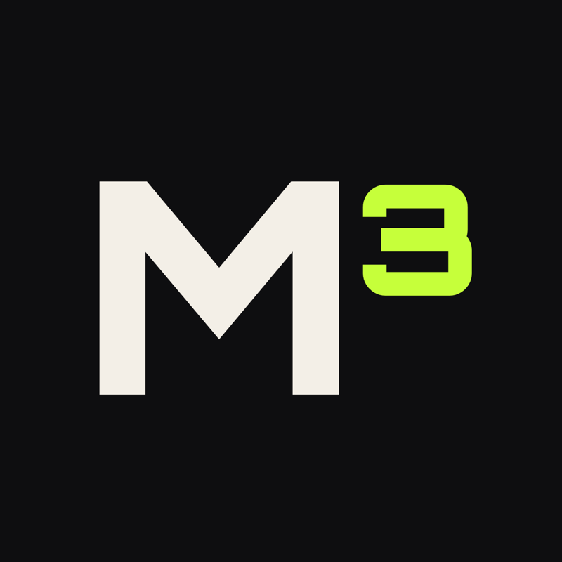

<div align="center">



# MY MUSCLE MUSE

### M³RC — a run club for every pace, in Hyderabad.

**All paces welcome, _Always._**

[](#-when--where)
[](#-when--where)
[](#-when--where)

[**Live site → mymusclemuse.in**](https://mymusclemuse.in) &nbsp;·&nbsp; [Join the WhatsApp group](https://chat.whatsapp.com/CFBm8WvZtcU1TsnKjYdJpm) &nbsp;·&nbsp; [@mymusclemuse](https://instagram.com/mymusclemuse)

</div>

---

## // what this is

This is the website for **M³RC — the My Muscle Muse Run Club**: a free, no-gatekeeping running crew in Hyderabad. We meet at the Narsingi track twice a week and run together — walk, jog, or sprint. Every pace belongs.

> No egos. No drop pace. Just kilometres and good people.

The site itself is a single-page invite: what we're about, when we run, how to find us, and one button — **join the WhatsApp group.** That's it.

## 🏃 when & where

| | Day | Time | Meetup |
|---|---|---|---|
| 🟩 | **Wednesday** | 7:00 PM | Narsingi Cycle &amp; Walking Track |
| 🟪 | **Friday** | 7:00 PM | Narsingi Cycle &amp; Walking Track |

📍 **Meetup point:** [SmartBike stand, Narsingi track](https://maps.app.goo.gl/RCJNbEkn4Vnp8pm26) · Hyderabad

New to running? [Start with us.](https://chat.whatsapp.com/CFBm8WvZtcU1TsnKjYdJpm) There's no pace requirement — just show up.

## // meet the muse

**My Muscle Muse** is Divyani's personal fitness brand — and M³RC is its heart offline.

> Fitness has always been my anchor, but for me it's never just been about the heavy lifts in the gym — it's about the energy you share outside of it. Having just moved back to Hyderabad, the best way I know to reconnect with the city is by hitting the pavement. M³RC was born out of a desire to build a local fitness family from the ground up. Whether you're lacing up for the very first time or chasing a personal record, this space is yours.
>
> The goal is simple: build a crew where everyone feels strong enough to show up — and proud when they do.
>
> **— Divyani**

## // join us

- 💬 **[WhatsApp group](https://chat.whatsapp.com/CFBm8WvZtcU1TsnKjYdJpm)** — the one place everything happens (run days, changes, hype)
- 📸 **[Instagram @mymusclemuse](https://instagram.com/mymusclemuse)** — recaps, routes & the crew
- 🌐 **[mymusclemuse.in](https://mymusclemuse.in)**

---

## // under the hood

A hand-built static site — no framework, no build step, no tracking. Loads fast, works everywhere.

**Aesthetic:** dark, bold, Gen-Z neon — dot-grid texture, a faint **M³** watermark, and hard offset shadows on square boxes (no rounded corners).

| | |
|---|---|
| **Stack** | Single-page HTML + CSS (zero JS dependencies) |
| **Hosting** | GitHub Pages |
| **Domain** | `mymusclemuse.in` via AWS Route 53 (apex A/AAAA → GitHub Pages) |
| **Type** | Archivo Black (display) · Orbitron (the M³ mark) · Space Mono (body) |

**Palette**

| Token | Hex | |
|---|---|---|
| Ink (base) | `#0B0F1C` | blue-black |
| Lime | `#C6FF3A` | 🟩 |
| Pink | `#FF2E88` | 🟪 |
| Blue | `#3A5BFF` | 🟦 |
| Tang | `#FF6A00` | 🟧 |

### Run it locally

```bash
git clone git@github.com:Thar-Digital-Services/mymusclemuse.git
cd mymusclemuse
python3 -m http.server 8080
# open http://localhost:8080
```

### Structure

```
index.html      # the whole site
favicon.png     # M³ mark
logo-*.png      # M³ logos (dark / transparent)
pics/web/       # the single deployed photo
CNAME           # mymusclemuse.in
```

---

<div align="center">

**All paces welcome, _Always._**

Built with 🏃 by [Thar Digital Services](https://thar.digital)

</div>
